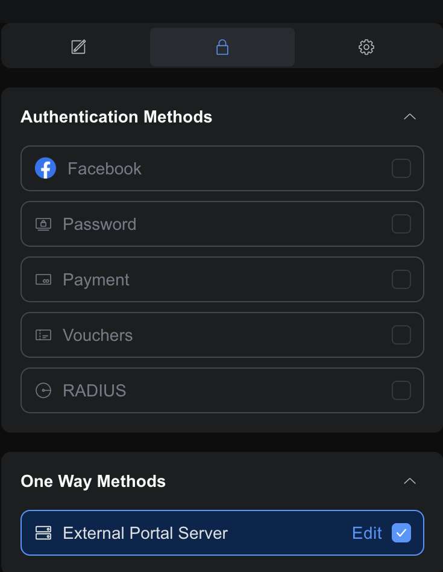

# unifi-govbr

Este projeto tem como objetivo fornecer acesso Wi-Fi por meio de um captive portal, utilizando autenticação integrada ao gov.br, em conjunto com um UniFi Network Server Controller.

A aplicação foi desenvolvida utilizando o framework [PHP Symfony](https://github.com/symfony/symfony) e faz uso da biblioteca [UniFi-API-client](https://github.com/Art-of-WiFi/UniFi-API-client) para realizar a integração com a controladora UniFi.

# Controladoras suportadas

As controladoras unifi suportadas, tanto de software como hardware, são as mesmas suportadas pela biblioteca [UniFi-API-client](https://github.com/Art-of-WiFi/UniFi-API-client).

# Requisitos

As bibliotecas necessárias para rodar a aplicação estão descritas no arquivo Dockerfile.

# Configurações na Controladora

A configuração na controladora é feita em duas etapas.

Primeiro, na aba "Authentication", é necessário definir um captive portal externo, informando o endereço onde esta aplicação estará em execução.

Em seguida, na aba "Settings", devem ser habilitadas as seguintes opções: "Show landing page", "HTTPS Redirection Support", "Secure Portal" e, opcionalmente, o campo "Domain".

Após essas configurações, sempre que um usuário se conectar à rede controlada pelo captive portal, ele será automaticamente redirecionado para a página de autenticação. Durante esse processo, a controladora enviará ao captive portal quatro informações: o endereço MAC do Access Point (AP) ao qual o usuário está conectado, o endereço MAC do dispositivo do usuário, a data e hora da tentativa de acesso e a URL original solicitada.

# Instalação

